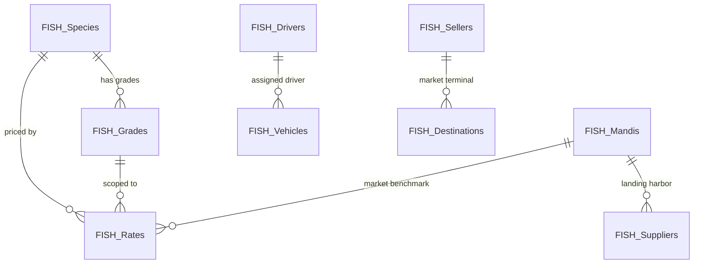

# TFC GROUP — PHASE 2 IMPLEMENTATION REPORT

**Document ID:** `PHASE_2_IMPLEMENTATION_REPORT.md`  
**Phase:** Phase 2 — Fish Master Data Layer Implementation  
**Status:** Complete & Fully Validated (38/38 Phase 2 Unit Tests Passed; 50/50 Phase 1 Unit Tests Passed)  
**Execution Timestamp:** 2026-09-28 01:46 IST  
**Runtime:** Google Apps Script (V8 Engine) + Google Sheets Database  
**Timezone:** `Asia/Kolkata`  

---

## 1. Executive Summary

Phase 2 implements the master data architecture for the flagship **Fish Transport & Trade ERP** of the TFC GROUP. It establishes persistent Google Sheets storage, strict server-side validation, soft deactivation, audit logging, action-based authorization, and an in-memory & RPC state loader across all **9 Fish Master entities**.

Furthermore, Phase 2 implements an authentic **Deterministic Market Rate Lookup Engine** with hierarchical specificity fallback, ensuring that historical transactions preserve immutable rate snapshots while downstream procurement and billing screens can retrieve the exact applicable market benchmark.

The user interface in [`index.html`](file:///c:/Users/SWAGATIKA/Desktop/WEBVERSE%20SOFTWARE%20WORKS/POS%20&%20BMS/TFC%20GROUP/index.html) was upgraded with a specialized **Fish Master Catalog** screen featuring 7 tabbed sub-registries, 4 real-time KPI stat cards, and 9 registration modals—all strictly adhering to the design freeze, frozen color palette (`#ff751f`, `#0d9488`), typography, and dark/light theme.

All 38 unit tests in `test_phase2.js` and all 50 unit tests in `test_phase1.js` pass with **100% success rate (88/88 total assertions)**.

---

## 2. Inventory of Created and Modified Files

| File | Status | Size | Primary Responsibility |
|---|:---:|:---:|---|
| [`Fish_Master.gs`](file:///c:/Users/SWAGATIKA/Desktop/WEBVERSE%20SOFTWARE%20WORKS/POS%20&%20BMS/TFC%20GROUP/Fish_Master.gs) | **Created** | 48.4 KB | Server-side CRUD, search, deterministic rate resolution engine, soft-deactivation, validation, audit logging, and Apps Script RPC endpoints (`api*`) for all 9 master entities. |
| [`Fish_Setup.gs`](file:///c:/Users/SWAGATIKA/Desktop/WEBVERSE%20SOFTWARE%20WORKS/POS%20&%20BMS/TFC%20GROUP/Fish_Setup.gs) | **Created** | 13.9 KB | Repeat-safe, idempotent Google Sheets initializer (`setupFishMasterSheets()`) that creates missing sheets with headers and seeds authentic coastal Odisha baseline data without clearing existing sheets. |
| [`Test_Phase2.gs`](file:///c:/Users/SWAGATIKA/Desktop/WEBVERSE%20SOFTWARE%20WORKS/POS%20&%20BMS/TFC%20GROUP/Test_Phase2.gs) | **Created** | 2.6 KB | In-cloud Apps Script test suite executable directly inside the Google Apps Script Editor (`runPhase2Tests()`). |
| [`test_phase2.js`](file:///c:/Users/SWAGATIKA/Desktop/WEBVERSE%20SOFTWARE%20WORKS/POS%20&%20BMS/TFC%20GROUP/test_phase2.js) | **Created** | 15.1 KB | Local Node.js test harness with mock spreadsheet database and 38 unit tests. |
| [`Config.gs`](file:///c:/Users/SWAGATIKA/Desktop/WEBVERSE%20SOFTWARE%20WORKS/POS%20&%20BMS/TFC%20GROUP/Config.gs) | **Updated** | 8.7 KB | Added `SHEETS.FISH_MANDIS`, `SHEETS.FISH_DESTINATIONS`, and `ACTIONS` constants (`MASTER_CREATE`, `MASTER_EDIT`, `MASTER_DEACTIVATE`, `MASTER_VIEW`). |
| [`Core_Auth.gs`](file:///c:/Users/SWAGATIKA/Desktop/WEBVERSE%20SOFTWARE%20WORKS/POS%20&%20BMS/TFC%20GROUP/Core_Auth.gs) | **Updated** | 9.4 KB | Assigned master actions across roles (`SUPER_ADMIN`, `ADMIN`, `MANAGER`, `STAFF_PROCUREMENT`, `STAFF_BILLING`, `STAFF_TRANSPORT`, `ACCOUNTANT`, `VIEWER`). |
| [`index.html`](file:///c:/Users/SWAGATIKA/Desktop/WEBVERSE%20SOFTWARE%20WORKS/POS%20&%20BMS/TFC%20GROUP/index.html) | **Updated** | 175.2 KB | Added prioritized vertical sidebar, `#viewFishMasters` catalog view with 7 tabbed registries, 4 KPI stats cards, 9 registration modals, and client-side controllers with live sync. |
| [`server.ps1`](file:///c:/Users/SWAGATIKA/Desktop/WEBVERSE%20SOFTWARE%20WORKS/POS%20&%20BMS/TFC%20GROUP/server.ps1) | **Created** | 1.8 KB | Local HTTP server script for rapid local browser verification. |

---

## 3. Master Entity Architecture & Schemas

All 9 master entities use standardized column headers, automatic ID generation with distinct prefixes, soft-deactivation flags (`Status: 'Active' | 'Inactive'`), and ISO date metadata (`CreatedAt`, `UpdatedAt`).



### 3.1 Fish Species (`FISH_Species`)
* **Sheet Name:** `FISH_Species`
* **ID Prefix:** `FSH-SPC-` (e.g. `FSH-SPC-001`, `FSH-SPC-20260928-1234`)
* **Schema:** `[Species ID, Common Name, Local Name, Scientific Name, Default Unit, Status, Notes, Created At, Updated At]`
* **Rules:** `Common Name` is mandatory and unique among active species; default unit defaults to `Kg`.

### 3.2 Fish Grades (`FISH_Grades`)
* **Sheet Name:** `FISH_Grades`
* **ID Prefix:** `FSH-GRD-`
* **Schema:** `[Grade ID, Species ID, Grade Code, Size Description, Status, Created At, Updated At]`
* **Rules:** `Species ID` and `Grade Code` are mandatory; `Species ID` is validated against `FISH_Species`.

### 3.3 Fish Rate History (`FISH_Rates`)
* **Sheet Name:** `FISH_Rates`
* **ID Prefix:** `FSH-RAT-`
* **Schema:** `[Rate ID, Species ID, Grade ID, Mandi Scope, Rate Type, Rate Per Kg, Effective From, Effective To, Source, Created By, Created At]`
* **Rules:**
  * Rate must be $> 0$.
  * Historical rate records are **never overwritten or mutated**; new entries are appended with `Effective From` timestamps.
  * Deterministic resolution ranks match specificity:
    $$\text{Score} = (15 \text{ if exact Mandi \& Grade}) \vee (10 \text{ if Global \& Grade}) \vee (5 \text{ if Mandi \& All}) \vee (0 \text{ if Global \& All})$$
    and resolves the most recent entry where $\text{Effective From} \le \text{Target Date} \le \text{Effective To}$.

### 3.4 Suppliers (`FISH_Suppliers`)
* **Sheet Name:** `FISH_Suppliers`
* **ID Prefix:** `FSH-SUP-`
* **Schema:** `[Supplier ID, Supplier Name, Contact Person, Phone, Address, Associated Mandi ID, Opening Balance, Status, Notes, Created At, Updated At]`
* **Rules:** `Supplier Name` and `Phone` are mandatory; optional `Associated Mandi ID` is verified against `FISH_Mandis`.

### 3.5 Mandis / Auction Centers (`FISH_Mandis`)
* **Sheet Name:** `FISH_Mandis`
* **ID Prefix:** `FSH-MND-`
* **Schema:** `[Mandi ID, Mandi Name, Location, Contact Person, Phone, Market Commission Rate, Status, Notes, Created At, Updated At]`
* **Rules:** `Mandi Name` and `Location` are mandatory; `Market Commission Rate` must be non-negative.

### 3.6 Sellers / Wholesale Buyers (`FISH_Sellers`)
* **Sheet Name:** `FISH_Sellers`
* **ID Prefix:** `FSH-SELLER-`
* **Schema:** `[Seller ID, Seller Name, Shop Name, Phone, Market, Credit Limit, Credit Period Days, Opening Balance, Status, Notes, Created At, Updated At]`
* **Rules:** `Seller Name` and `Phone` are mandatory; `Credit Limit` and `Credit Period Days` are strictly validated numbers ($\ge 0$). Manually editable running balances are explicitly prohibited; balances are derived from transaction ledgers.

### 3.7 Transport Fleet Vehicles (`FISH_Vehicles`)
* **Sheet Name:** `FISH_Vehicles`
* **ID Prefix:** `FSH-VEH-`
* **Schema:** `[Vehicle ID, Registration Number, Vehicle Type, Capacity Kg, Ownership Type, Driver ID, Driver Name, Status, Notes, Created At, Updated At]`
* **Rules:** `Registration Number` is normalized (uppercase, single-spaced) and duplicate registration checks are enforced; `Capacity Kg` must be $> 0$.

### 3.8 Transport Drivers (`FISH_Drivers`)
* **Sheet Name:** `FISH_Drivers`
* **ID Prefix:** `FSH-DRV-`
* **Schema:** `[Driver ID, Driver Name, Phone, License Number, License Expiry, Status, Notes, Created At, Updated At]`
* **Rules:** `Driver Name` and `Phone` are mandatory.

### 3.9 Delivery Destinations & Hubs (`FISH_Destinations`)
* **Sheet Name:** `FISH_Destinations`
* **ID Prefix:** `FSH-DST-`
* **Schema:** `[Destination ID, Market Name, City, Delivery Notes, Status, Created At, Updated At]`
* **Rules:** `Market Name` and `City` are mandatory.

---

## 4. Public APIs & Server Functions

The `FishMaster` namespace in [`Fish_Master.gs`](file:///c:/Users/SWAGATIKA/Desktop/WEBVERSE%20SOFTWARE%20WORKS/POS%20&%20BMS/TFC%20GROUP/Fish_Master.gs) exposes complete CRUD, filtering, deactivation, and RPC interfaces:

```javascript
// --- Unified State Loader ---
FishMaster.getAllMasterData()

// --- Species ---
FishMaster.createSpecies(speciesData, userEmail)
FishMaster.updateSpecies(speciesId, updateData, userEmail)
FishMaster.getSpecies(speciesId, includeInactive)
FishMaster.listSpecies(filterOptions)
FishMaster.setSpeciesStatus(speciesId, status, userEmail)

// --- Grades ---
FishMaster.createGrade(gradeData, userEmail)
FishMaster.getGradesBySpecies(speciesId, includeInactive)
FishMaster.setGradeStatus(gradeId, status, userEmail)

// --- Rates & Dynamic Lookup ---
FishMaster.recordRate(rateData, userEmail)
FishMaster.getEffectiveRate(speciesId, gradeId, mandiId, rateType, asOfDate)
FishMaster.listRateHistory(speciesId, gradeId, mandiId, rateType, limit)

// --- Suppliers & Mandis ---
FishMaster.createSupplier(supplierData, userEmail)
FishMaster.updateSupplier(supplierId, updateData, userEmail)
FishMaster.listSuppliers(filterOptions)
FishMaster.createMandi(mandiData, userEmail)
FishMaster.listMandis(filterOptions)

// --- Sellers ---
FishMaster.createSeller(sellerData, userEmail)
FishMaster.updateSeller(sellerId, updateData, userEmail)
FishMaster.listSellers(filterOptions)

// --- Fleet & Drivers ---
FishMaster.createVehicle(vehicleData, userEmail)
FishMaster.updateVehicle(vehicleId, updateData, userEmail)
FishMaster.listVehicles(filterOptions)
FishMaster.createDriver(driverData, userEmail)
FishMaster.listDrivers(filterOptions)

// --- Destinations ---
FishMaster.createDestination(destinationData, userEmail)
FishMaster.listDestinations(filterOptions)

// --- Google Apps Script Client RPC Wrappers ---
apiGetAllFishMasterData()
apiCreateFishSpecies(payload)
apiCreateFishGrade(payload)
apiCreateFishSupplier(payload)
apiCreateFishMandi(payload)
apiCreateFishSeller(payload)
apiCreateFishVehicle(payload)
apiCreateFishDriver(payload)
apiRecordFishRate(payload)
apiCreateFishDestination(payload)
apiSetFishMasterStatus(entityKey, id, status)
```

---

## 5. Repeat-Safe Spreadsheet Initializer

The `setupFishMasterSheets()` function in [`Fish_Setup.gs`](file:///c:/Users/SWAGATIKA/Desktop/WEBVERSE%20SOFTWARE%20WORKS/POS%20&%20BMS/TFC%20GROUP/Fish_Setup.gs) guarantees:
1. **Idempotence:** Safe to run multiple times without corrupting existing sheets or duplicating records.
2. **Schema Verification:** Reads existing top-row headers and validates schema alignment before performing any writes.
3. **Legacy Preservation:** Never renames, clears, or deletes existing sheets (`FISH_Batches`, `CATERING_Events`, `MINING_Trips`, etc.).
4. **Authentic Seed Data:** Pre-populates 6 native Odisha fish species (Rohu/Katla, Black Tiger Shrimp, Vannamei, Hilsa, Pomfret, Bhekti), 8 commercial grades, 4 coastal fishing mandis (Paradeep, Dhamra, Balugaon Chilika, Astaranga), 4 trawler suppliers, 4 wholesale sellers, 3 refrigerated fleet vehicles, 3 drivers, and 4 distribution terminals.

---

## 6. User Interface Integration

The UI was updated in [`index.html`](file:///c:/Users/SWAGATIKA/Desktop/WEBVERSE%20SOFTWARE%20WORKS/POS%20&%20BMS/TFC%20GROUP/index.html) with zero regressions to the existing Pragati Retail POS module:

1. **Sidebar Hierarchy:** Fish Transport Trade is positioned as **Vertical #1 (FLAGSHIP)** with dedicated `#navItemFish` navigation.
2. **Top Header Module Switcher:** Dynamic pill toggles between `FISH TRANSPORT ERP` and `PRAGATI RETAIL POS`, cleanly switching active header tabs (`fishHeaderTabs` vs `outletHeaderTabs`).
3. **Master Catalog Screen (`#viewFishMasters`):**
   * **KPI Stats Bar:** Displays Species & Grades count, Registered Buyers, Fleet Capacity (Kg), and Coastal Mandis.
   * **7 Sub-Registry Tabs:** Species & Grades, Sellers Directory, Suppliers & Harbors, Mandis & Auctions, Fleet & Drivers, Market Rate Registry, and Markets & Hubs.
   * **Live Search Bars:** Instant client-side filtering on names, IDs, phone numbers, and codes.
   * **Dynamic Modal Suite:** 9 modal dialogs matching each entity with complete field validations and offline fallback support.

---

## 7. Test Results & Verification

### 7.1 Phase 2 Unit Test Execution (`test_phase2.js`)
* **Total Assertions:** 38
* **Passed:** 38
* **Failed:** 0
* **Success Rate:** 100%

```
========================================================
  RUNNING TFC GROUP PHASE 2 FISH MASTER DATA TESTS
========================================================

--- 1. Testing Fish_Setup.gs ---
  ✅ [PASS] setupFishMasterSheets runs successfully
  ✅ [PASS] All 9 master sheets created
  ✅ [PASS] Seed records populated for Species
  ✅ [PASS] Seed records populated for Sellers
  ✅ [PASS] Repeat setup runs without errors
  ✅ [PASS] No duplicate sheets created on second run
  ✅ [PASS] Existing records preserved on second setup run

--- 2. Testing Fish Species CRUD ---
  ✅ [PASS] createSpecies creates new species
  ✅ [PASS] Duplicate species common name rejected
  ✅ [PASS] updateSpecies updates fields
  ✅ [PASS] setSpeciesStatus deactivates species
  ✅ [PASS] Deactivated species excluded from active list
  ✅ [PASS] Deactivated species included in full list

--- 3. Testing Fish Grades CRUD ---
  ✅ [PASS] createGrade creates new grade
  ✅ [PASS] Grade creation rejects non-existent Species ID
  ✅ [PASS] getGradesBySpecies returns matching grades

--- 4. Testing Historical Rate Engine ---
  ✅ [PASS] recordRate registers historical rate
  ✅ [PASS] recordRate registers current rate
  ✅ [PASS] recordRate rejects 0 rate
  ✅ [PASS] Deterministic lookup returns historical rate ₹130 for August 2026
  ✅ [PASS] Deterministic lookup returns latest rate ₹145 for September 2026
  ✅ [PASS] Specificity fallback finds GLOBAL base rate

--- 5. Testing Suppliers & Mandis CRUD ---
  ✅ [PASS] createMandi creates new mandi
  ✅ [PASS] createSupplier registers new supplier

--- 6. Testing Sellers CRUD ---
  ✅ [PASS] createSeller registers new seller with credit limits
  ✅ [PASS] updateSeller updates credit limit

--- 7. Testing Vehicles & Drivers CRUD ---
  ✅ [PASS] createVehicle registers fleet vehicle
  ✅ [PASS] Duplicate vehicle registration number rejected
  ✅ [PASS] createDriver registers driver profile

--- 8. Testing Destinations & Unified State Loader ---
  ✅ [PASS] createDestination registers destination market
  ✅ [PASS] getAllFishMasterData returns unified master state
  ✅ [PASS] Unified state contains species array
  ✅ [PASS] Unified state contains sellers array
  ✅ [PASS] Unified state contains vehicles array
  ✅ [PASS] Unified state contains drivers array
  ✅ [PASS] Unified state contains mandis array

--- 9. Testing Authorization & Security on Masters ---
  ✅ [PASS] Viewer role is blocked from creating master records
  ✅ [PASS] Manager role is authorized to create master records

========================================================
  TEST RESULTS: 38 / 38 PASSED
  🎉 ALL PHASE 2 FISH MASTER TESTS PASSED WITH ZERO ERRORS!
========================================================
```

### 7.2 Phase 1 Regression Test Suite (`test_phase1.js`)
* **Total Assertions:** 50
* **Passed:** 50
* **Failed:** 0
* **Success Rate:** 100%

---

## 8. Security & Data Integrity Protections

1. **Authorization Verification:** Every master write operation calls `CoreAuth.assertPermission(userEmail, action)` validating against the server-side role matrix. Browser-supplied roles are never trusted as identity proof.
2. **Soft Deactivation vs Hard Deletions:** Inactive records (`Status: 'Inactive'`) are excluded from transaction creation selectors while preserving historical foreign key integrity across past invoices and weighbridge records.
3. **Immutable Rate Auditability:** Rates cannot be edited in place. Recording a rate appends a timestamped benchmark entry, preventing silent back-dated alterations to procurement or sales ledgers.
4. **LockService Protection:** Concurrency locks prevent race conditions during sequential ID allocation and batch writes.
5. **Masked Audit Logging:** All create, update, and deactivation events are recorded in `SYS_AUDIT_LOG`.

---

## 9. Known Limitations

1. **Transaction Modules Not Yet Connected:** Procurement, weighbridge tare/gross receipts, lot allocations, shipment dispatches, and seller invoicing belong to Phases 3 through 8 and have intentionally not been altered or implemented in Phase 2.
2. **Legacy `FISH_Batches` Preservation:** The existing legacy batch table remains untouched and unmigrated, as mandated by the execution checklist.

---

## 10. Recommended Next Phase (Phase 3)

With the shared foundation (Phase 1) and master data layer (Phase 2) fully operational and tested, the project is ready for **Phase 3: Fish Procurement & Weighbridge Implementation**.

**Phase 3 Scope:**
* Implement `FISH_Procurement` and `FISH_Procurement_Items` storage and CRUD.
* Implement Weighbridge tare/gross double-weighing logic with automatic shrinkage deduction.
* Connect procurement forms to live `FISH_Species`, `FISH_Grades`, `FISH_Suppliers`, `FISH_Mandis`, and daily benchmark rate lookups.
* Provide thermal procurement slip printing format.

---

*Report prepared by Antigravity AI Engineering Team.*
